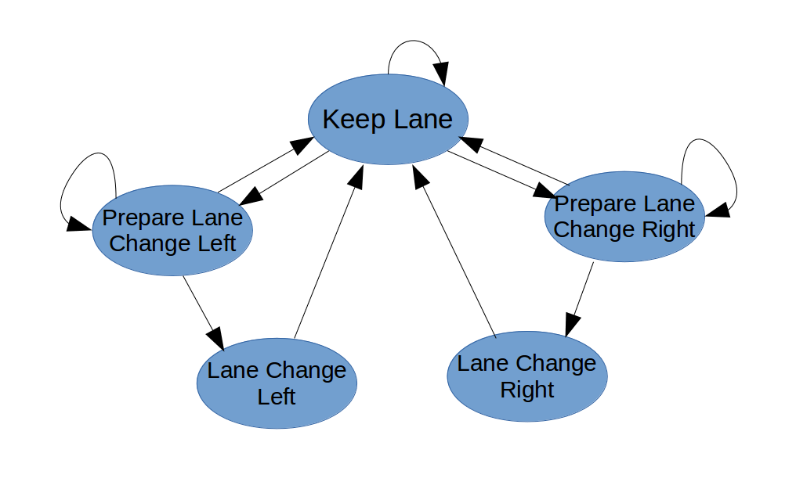
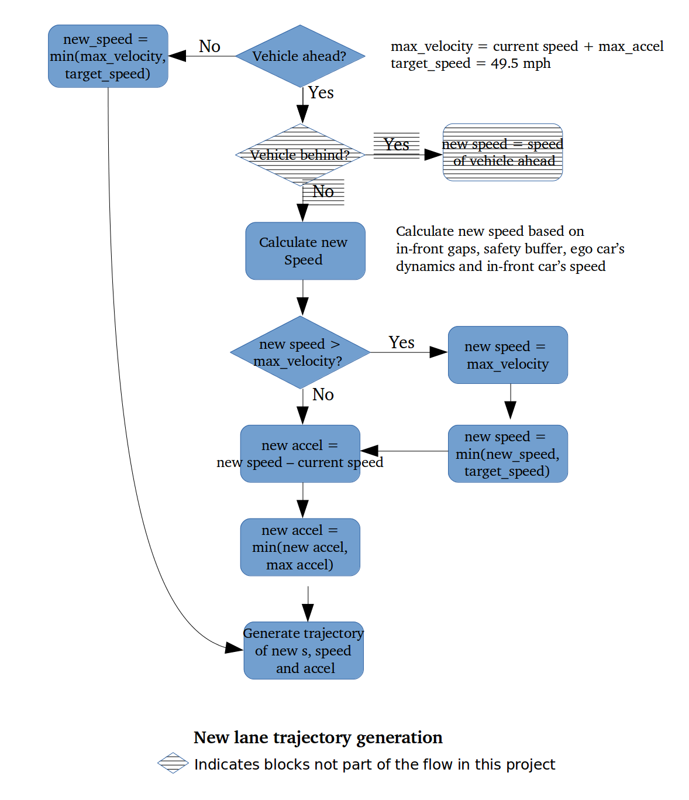

### CarND-Path-Planning-Project

##### Refer to [project starter code](https://github.com/udacity/CarND-Path-Planning-Project) for
1. Environment set up / Dependencies
2. [Simulator download](https://github.com/udacity/self-driving-car-sim/releases/tag/T3_v1.2)
3. Map and localization/sensor data details

##### Build Instructions

1. Clone this repo.
2. Make a build directory: `mkdir build && cd build`
3. Compile: `cmake .. && make`
4. Run it: `./path_planning`.

---

### Objective: Create a path planner
such that
- The car is able to drive at least 4.32 miles following the rules without incidents
- The car performs optimized lane changing (i.e., the car only changes into a lane that improves its forward progress).

### Rules:
- The car drives according to the speed limit (50 mph) and isn't driving much slower than speed limit unless obstructed by traffic.
- Max Acceleration and Jerk are not Exceeded. The car does not exceed a total acceleration of 10 m/s^2 and a jerk of 10 m/s^3.
- Car does not have collisions. The car must not come into contact with any of the other cars on the road.
- The car stays in its lane, except for the time between changing lanes. The car is able to smoothly change lanes when it makes sense to do so, such as when behind a slower moving car and an adjacent lane is clear of other traffic.

### Model details
There are three key components in the implementation:
- Finite State Machine (FSM) / Trajectory generation
- Cost functions
- Path smoothing function (Waypoints generation)

and 5 major classes:
- Road: interfaces to simulator; advances ego car to the next state upon receiving new localization/sensor data
- Vehicle: ego car
- OtherVehicle: other cars
- Cost: Calculates trajectory cost
- PathPlanner: picks the best trajectory from possible trajectories based on calculated trajectory costs

#### FSM
An FSM is to represent the state space and state transitions of the ego car.

 

Abbreviations:
- KL: Keep Lane
- PLCL: Prepare Lane Change Left
- PLCR: Prepare Lane Change Right
- LCL: Perform Lane Change Left
- LCR: Perform Land Change Right

(T: time interval (e.g., 1 sec or 0.5 sec))

Each time a new localization/sensor data comes in, the Road updates ego car and other cars’ current poses and twists, and generates predicted movements within T for other cars (here, we assume other cars are traveling at constant speeds). The PathPlanner then takes ego car and the predictive movements of other cars to generate and evaluate possible trajectories.

The possible next states are illustrated in above FSM diagram. For example, if the ego car’s current state is KL, PathPlanner will generate trajectories for the new states {KL, PLCL and PLCR}, calculates costs for each trajectory, and pick the one with the lowest cost to be the ego car’s next state. Based on the trajectory picked by PathPlanner, the ego car then generate a set of new waypoints for the simulator.

#### Trajectory generation
The PathPlanner uses the flow charts below to determine the ego car’s new speed at new lane. New lane is the same as the current lane for new states {KL, PLCL, PLCR}, and +/-1 for new states {LCR, LCL} respectively.

 

For new states LCL and LCR, in addition to determining the new speeds, the PathPlanner also consider if there are enough spaces in-front and behind the ego car after it changes to the new lane. If either of the spaces is not big enough, the trajectory will not be generated for evaluation.

Once the ego car’s new speed is known, the new Frenet s and the new acceleration are calculated, thus the new trajectory is generated for evaluation.

There is one implementation details in trajectory generation. In this project, the ego car considers lane change only when it is behind a slower moving car. If we only consider the current and next states, PLCL/R will always has the same trajectory cost as KL and never be selected as the best trajectory. To break this unfairness, a pseudo third state is added to the trajectory to capture the fact that PLCL/R may yield a better future if the realized new state has speed and/or larger in-between buffer benefit.

At some situations, like the other cars in front suddenly decelerating a lot or the other cars abruptly changing lane, the “maximum acceleration exceeds” errors are easily encountered. To prevent the ego car changing its speed too quickly, an adaptive buffer mechanism is implemented. While a large safety buffer between the ego car and the car in-front is preferred, smaller safety buffers are also allowed if the distance between the ego car and the car in-front is less than expected. For example, for distances greater than or equal to 40 meters, the safety buffer is set to be 40 meters; for distances 20 meters to 40 meters, the safety buffer is set to the distance, and distances less than 20 meters buffer is set to 20 meters (which is the minimum buffer size to avoid collisions).

#### Cost functions
Cost functions are essential in determining the ego car’s next move. In order to keep the ego car safely distant from other cars while optimizing its speed, three cost functions are used to calculate the cost of a trajectory:
- Inefficient cost: A value between 0 and 1. The value is 0 if the projected speed is equal to target_speed, and it increases with the speed deviating from the target speed. An exponential function is applied to the deviation to calculate this value.
- Buffer cost: A value to reflect the distances between the ego car and the other cars. The larger the distance the less the cost. An inverse exponential function is applied so that zero/near-zero distances yield ~1 and large distances give ~0 value. For LCL and LCR, distance in-front and distance behind are equally important. For other cases, more weight is put on the distance in-front.
- Lane change cost: A value of 0 or 1. 0 for non- lane changing states {KL, PLCL, PLCR} and 1 for lane changing states {LCL, LCR}. This is to add some penalty to lane changing, so that the ego car will do lane change only when speed and/or buffer benefit is large enough.

Collision cost is not implemented as the buffer cost is effective to keep the ego car distant from the other cars. For future improvement, there are other cost functions to be added, for example, max acceleration cost and max jerk cost. These cost functions require enhanced data structures to capture the acceleration and jerk of the ego car and other cars.

#### Path smoothing function (Waypoints generation)
Once the PathPlanner picks the best next trajectory for the ego car,  we use the following steps to generate new waypoints for simulator:
1. Generate a smooth spline using
   - points from the end of the previous waypoints update, and
   - points ahead of the end of the previous waypoints toward the new trajectory

2. Generate new waypoint set using the leftover waypoints, and add new waypoints by selecting points from the spline generated in step 1.

getXy() in helper.h is a convenient function. We can easily fit a spline and selecting points on the spline in Frenet coordinate, and then use getXY() to transform the points back to XY coordinate.

### Tuned parameters and values used in project
- time interval T: the other cars’ movements are predicted for the next T, the ego car’s trajectories are generated for next T, and the waypoints are generated for next T (T=0.5 sec)
- horizon: how far the highway in-front and behind the ego car that we are considering (horizon=200 m)
- maximum acceleration (m/s^2) during T (max acceleration=3.36 m/s^2)
- safety buffers: buffers in-front/behind of staying current lane, and buffers in-front/behind of lane changing cases (max_buffer=40m, min_buffer=20m, lane_change_buffer=30m)
- cost function weights: weights of each cost functions
